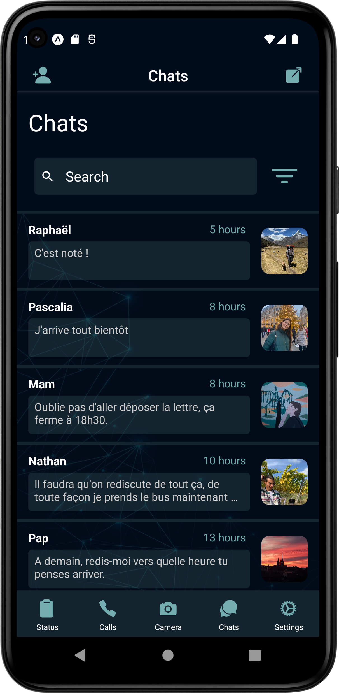

 <p></p>

# Chat App using React Native

Implementation of a mobile application working in IOS and Android using React Native for the frontend and AWS Amplify for the backend. The data is fetched from and updated on AWS with GraphQL APIs. 

As displayed below, the application allows multiple users to have live conversations, based on an authentication at startup where you can create an account. It is possible to create groups and delete/add members after creation.

<br/>
<br/>
<br/>

<h2 align="center">
Real-time messages
</h2>

<br/>

<p align="center">

</p>

<br/>

<h2 align="center">
Create group (left) or Delete group members (right) functionalities
</h2>

<br/>

<p align="center">

&nbsp; &nbsp; &nbsp; &nbsp; &nbsp; &nbsp;

</p>

<br/>

<h2 align="center">
Login/Logout functionality
</h2>

<br/>

<p align="center">

&nbsp; &nbsp; &nbsp; &nbsp; &nbsp; &nbsp;

</p>

<br/>

Dependencies for React Native Navigation :

```
$ npx expo install @react-navigation/native @react-navigation/native-stack @react-navigation/bottom-tabs react-native-screens react-native-safe-area-context

$ npm install react-native-safe-area-context
```

Dependencies for the backend with AWS amplify :

```
$ npm install aws-amplify aws-amplify-react-native amazon-cognito-identity-js @react-native-community/netinfo @react-native-async-storage/async-storage
```

To generate the GraphQL queries :

```
$ amplify codegen add
```
